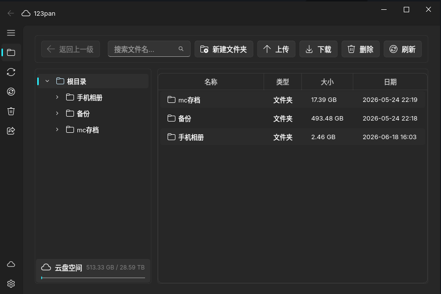

<div align="center">

# [123pan](https://www.123panng.top)

第三方 123 云盘桌面客户端

<p>
  <a href="https://github.com/123panNextGen/123pan/stargazers"></a>
  <a href="https://github.com/123panNextGen/123pan/issues"></a>
  <a href="./LICENSE"></a>
  <a href="https://www.python.org/downloads/"></a>
  <a href="https://github.com/123panNextGen/123pan/releases"></a>
  <a href="https://github.com/123panNextGen/123pan/releases"></a>
</p>



</div>

## 项目简介

123pan 是由 [123panNextGen](https://github.com/123panNextGen) 维护的第三方 123 云盘桌面客户端，基于 Python、PySide6 和 PySide6-Fluent-Widgets 开发。项目通过模拟安卓客户端协议，改善官方 PC 客户端的自用流量限制，并提供文件管理、上传下载、离线下载、文件夹同步和多账号管理等功能。

项目以 GPLv3 协议开源，代码同步托管于 [GitHub](https://github.com/123panNextGen/123pan) 和 [Codeberg](https://codeberg.org/123panNextGen/123pan)。

> [!IMPORTANT]
> 本项目与 123 云盘官方无关。客户端能力依赖 123 云盘服务端接口，部分功能可能随服务端策略调整而变化。

## 功能特性

### 文件管理

- 目录树与表格视图，支持搜索、排序、面包屑导航和列宽调整
- 新建文件夹、重命名、移动、复制和删除文件
- 多目标复制，以及将文件复制到指定目录
- 回收站恢复与永久删除
- 免费及付费分享管理，可创建、复制和删除分享链接

### 上传与下载

- 多线程分片下载、断点续传，以及 429 / 5xx 错误退避重试
- 分片上传、断点续传和秒传
- 文件夹上传与上传前校验进度
- 上传、下载任务的暂停、继续、取消和优先级调整
- 上传下载限速，以及线程数和并发任务数设置
- 实时速度、进度和任务状态显示
- HTTP / SOCKS5 下载代理

### 离线下载与秒传

- 支持 HTTP、HTTPS、Magnet 和迅雷链接，由 123 云盘服务器执行离线下载
- 导入 123FastLink 或兼容的秒传 JSON 数据
- 导出秒传链接和 JSON 数据，便于跨客户端分享

### 文件夹同步

- 将本地文件夹单向同步到云端目录
- 支持手动同步和 30 秒、1 分钟、5 分钟、30 分钟、1 小时定时同步
- 可选“本地删除时同步删除云端文件”
- 支持关闭到系统托盘和登录后最小化运行

### 登录与账号

- 账号密码登录和 123 云盘 App 扫码登录
- 多账号保存与快速切换
- 安卓设备型号模拟

### 文件预览

- 图片：PNG、JPEG、WebP、GIF、SVG 等常见格式
- 文本与代码：TXT、Markdown、JSON、Python、JavaScript 等常见格式
- PDF、音频和视频

### 界面与设置

- 简体中文和英文界面
- 跟随系统、浅色和深色主题
- Windows 11 Mica 效果与窗口透明度调节
- 可配置日志等级，日志保留最近 7 天

## 下载与运行

> [!WARNING]
> **免责声明**
>
> 本项目仅供个人学习与技术研究，与 123 云盘官方无任何关联。软件按“现状”提供，不作任何明示或暗示的保证。使用者应自行承担数据丢失、账号限制、服务中断等风险，并遵守 123 云盘用户协议及相关法律法规。请勿将本软件用于商业用途。

### 使用发行版

前往 [GitHub Releases](https://github.com/123panNextGen/123pan/releases) 下载适合当前系统的版本。目前项目提供 Windows、Linux 和 macOS 构建，具体可用平台与架构以各版本的附件说明为准。

也可从项目下载站获取发行版：<https://download.123panng.top/>。下载站经由 Cloudflare CDN 分发，更新可能略有延迟。

解压后运行 Windows 版本中的 `123pan.exe`、Linux 版本中的 `123pan`，或打开 macOS 应用包。

> [!NOTE]
> 当前 Nuitka 打包产物在包含非 ASCII 字符的路径中可能无法启动。若发行版启动后立即退出，请将程序完整解压到纯英文路径后重试。源码运行不受此限制。

### 从源码运行

需要 Python 3.12 或更高版本，并提前安装 [uv](https://docs.astral.sh/uv/)。

```shell
git clone https://github.com/123panNextGen/123pan.git
cd 123pan
uv sync
uv run src/123pan.py
```

需要参与开发时，可按需安装测试、代码检查和构建依赖：

```shell
uv sync --group test --group lint --group build
```

## 快捷键

| 快捷键 | 操作 |
| --- | --- |
| `F5` | 刷新文件列表 |
| `Ctrl+N` | 新建文件夹 |
| `Ctrl+U` | 上传文件 |
| `Ctrl+D` | 下载选中项 |
| `Delete` | 删除选中项 |
| `F2` | 重命名选中项 |
| `Backspace` | 返回上级目录 |
| `Ctrl+F` | 聚焦搜索框 |
| `Ctrl+A` | 全选文件 |
| `Enter` | 进入文件夹或预览文件 |

## 常见问题

### 为什么杀毒软件提示风险？

发行版暂未进行代码签名，部分安全软件可能产生误报。请仅从 GitHub Releases 或项目官网下载，并可通过本仓库源码核对程序行为。

### 程序无法启动或启动后立即退出怎么办？

1. 确认下载了适合当前操作系统和处理器架构的版本。
2. 将发行版完整解压后再运行，不要直接在压缩包内启动。
3. 若程序位于中文或其他非 ASCII 路径中，将其移动到纯英文路径后重试。
4. Windows 用户可检查安全软件拦截记录；源码运行用户请确认 Python 版本不低于 3.12，并已执行 `uv sync`。

### 下载速度不理想怎么办？

可在“设置 → 下载设置”中调整下载线程数、最大并发下载数和速度限制。若启用了网络代理，也应检查代理链路是否成为瓶颈。实际速度仍会受到网络环境、账号状态和服务端策略影响。

### 如何提交问题或建议？

提交前请先搜索已有 [Issues](https://github.com/123panNextGen/123pan/issues)。报告问题时，建议附上系统版本、客户端版本、复现步骤和脱敏后的日志。

## 参与开发

- [贡献指南](./CONTRIBUTING.md)
- [开发文档](./doc/wiki.md)
- [开发计划](./doc/TODO.md)

常用命令：

```shell
uv run pytest                    # 运行全部测试
uv run pytest tests/unit/        # 运行单元测试
uv run pytest --cov              # 生成覆盖率报告
./script/lint.sh                 # 运行项目代码检查
```

## 社区与反馈

- [GitHub Issues](https://github.com/123panNextGen/123pan/issues)
- [GitHub Discussions](https://github.com/123panNextGen/123pan/discussions)
- QQ 群：996241397

## 开源协议

本项目基于 [GNU General Public License v3.0](./LICENSE) 开源。

## 致谢

本项目由 [123panNextGen](https://github.com/123panNextGen) 团队维护，感谢所有参与开发、测试和反馈的贡献者。完整名单见 [GitHub Contributors](https://github.com/123panNextGen/123pan/graphs/contributors)。

感谢以下项目提供的思路：

- [123pan_unlock](https://github.com/QingJ01/123pan_unlock)