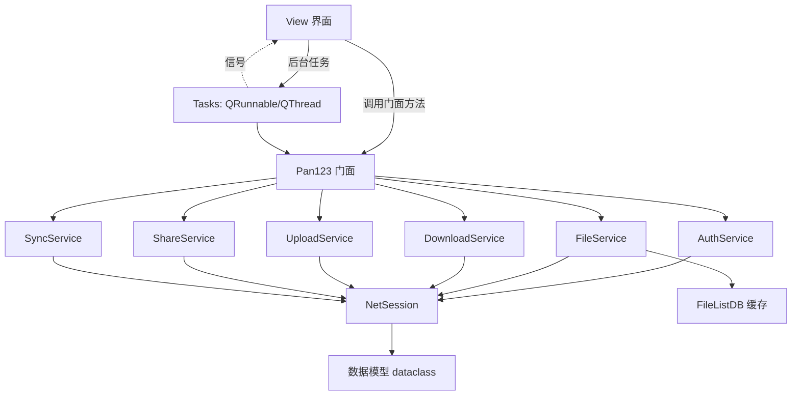

# 123pan Wiki

>[!IMPORTANT]
>含有AI生成内容，请注意辨别

## 目录

- [1. 技术栈与依赖](#1-技术栈与依赖)
- [2. 快速开始](#2-快速开始)
- [3. 项目架构](#3-项目架构)
- [4. 启动流程](#4-启动流程)
- [5. 数据存储（SQLite）](#5-数据存储sqlite)
- [6. 模块调用方法](#6-模块调用方法)
- [7. 设置项说明](#7-设置项说明)
- [8. 设备伪装](#8-设备伪装)
- [9. 二维码登录](#9-二维码登录)
- [10. 文件夹同步](#10-文件夹同步)
- [11. 传输设计（下载 / 上传）](#11-传输设计下载--上传)
- [12. 测试](#12-测试)
- [13. 开发须知与代码规范](#13-开发须知与代码规范)
- [14. 构建打包（Nuitka）](#14-构建打包nuitka)
- [15. 日志](#15-日志)
- [16. 常见问题与陷阱](#16-常见问题与陷阱)

---

## 1. 技术栈与依赖

| 依赖 | 版本 | 用途 |
| --- | --- | --- |
| Python | `>=3.12` | 运行时 |
| `pyside6` | `>=6.10` | Qt 绑定（2026-08 由 PyQt6 迁移而来） |
| `pyside6-fluent-widgets` | `>=1.11.1` | Fluent 风格组件（qfluentwidgets） |
| `shiboken6` | `>=6.10` | 对象存活判断（`isValid`） |
| `requests` | `>=2.32.5` | HTTP 客户端 |
| `cryptography` | `>=50.0.0` | 密码 AES-256-GCM 加密 |
| `zstandard` | `>=0.25.0` | 数据压缩 |
| `qrcode[pil]` | `>=8.2` | 扫码登录二维码生成 |

依赖分组（`pyproject.toml`）：

```shell
uv sync                          # 运行时依赖
uv sync --group test             # + pytest / pytest-mock / responses / coverage
uv sync --group lint             # + pylint / mypy
uv sync --group build            # + nuitka
uv sync --group dev              # + pyrefly
uv sync --group format           # + black
```

> [!IMPORTANT]
> `uv sync` 不带 group 会**移除**测试/构建依赖。跑测试必须 `uv run --group test pytest`，
> 或直接使用 `script/test.sh`。

依赖源默认使用阿里云镜像（`[[tool.uv.index]]`）。

---

## 2. 快速开始

```shell
git clone https://github.com/123panNextGen/123pan.git
cd 123pan
uv sync --group test --group lint --group build
uv run src/123pan.py
```

打包版可执行文件必须位于**纯 ASCII 路径**（详见[第 14 节](#14-构建打包nuitka)）。

---

## 3. 项目架构

### 3.1 目录结构

```
src/
  123pan.py                  # 入口：初始化日志/i18n/主题，创建 QApplication 与 MainWindow
  app/
    api/                     # API 层：HTTP 请求 + 数据模型，无业务逻辑
      session.py             # NetSession（FileSessionMixin + DownloadEngine 组合）
      session_file.py        # FileSessionMixin —— 文件/目录端点
      download_engine.py     # DownloadEngine —— 多线程分片下载（mixin）
      download_url.py        # 下载链接相关工具
      constants.py           # 域名常量（消除循环导入）
      model.py               # dataclass 数据模型（slots=True）
    common/                  # 公共层：门面 / 配置 / 存储 / 工具
      api.py                 # Pan123 —— 向后兼容门面（Facade）
      config.py              # ConfigManager —— 设置/账户（SQLite）
      const.py               # CONFIG_DIR、版本号等常量
      credential.py          # AES-256-GCM 加密凭据
      database.py            # Database 单例 —— SQLite 封装（WAL）
      file_list_db.py        # FileListDB —— 目录列表缓存（dir_cache）
      sync_store.py          # SyncStore —— 同步任务存储
      transfer_store.py      # TransferStore —— 传输任务/历史存储
      speed_limiter.py       # SpeedLimiter —— 令牌桶限速器
      i18n.py                # TranslationManager —— 多语言
      log.py                 # 日志（文件 + 控制台，7 天轮转）
      resource.py            # Qt 资源注册（pyside6-rcc 生成，:/(prefix) 路径），入口 import，勿删
      style_sheet.py         # QSS 样式
      utils.py               # format_file_size 等工具函数
    data/
      devices.py             # 设备伪装数据（机型/系统列表）
    preview/                 # 文件预览：image/text/pdf/audio/video + preview_manager
    resource/
      resource.qrc           # Qt 资源描述（prefix /123pan）
      i18n/                  # zh_CN.json / en_US.json 翻译文件
      qss/                   # 样式表
    service/                 # Service 层：业务逻辑编排，禁止 import Qt
      auth_service.py        # 登录 / 凭证持久化 / 设备指纹 / 二维码
      file_service.py        # 文件列表 / 增删改移 / 回收站 / 分享创建
      download_service.py    # 下载链接获取 + 下载执行
      upload_service.py      # 分片上传 + 断点续传
      share_service.py       # 免费/付费分享列表管理
      sync_service.py        # 文件夹同步（本地 → 云端）
    tasks/                   # Tasks 层：Qt 后台任务 + 信号
      signals.py             # 全部信号类（_XxxSignals）
      file_tasks.py          # QRunnable 任务 + track_task 引用追踪
      qr_login_tasks.py      # 扫码登录任务
      transfer_tasks.py      # TransferTask / UploadThread / DownloadThread
      sync_manager.py        # SyncManager —— 全局同步调度器（QTimer）
      sync_tasks.py          # SyncRunThread（QThread）
    view/                    # View 层：PySide6 界面
      main_window.py         # MainWindow（FluentWindow，懒加载导航）
      file_interface.py      # 文件浏览（表格 + 树 + 面包屑）
      file_table.py          # FileTableManager（渲染/排序/过滤）
      file_tree.py           # FileTreeManager（懒加载/缓存）
      login_window.py        # LoginDialog（密码 / 扫码 Tab）
      qr_login_page.py       # QRLoginPage（二维码登录页）
      transfer_interface.py  # 传输管理（上传/下载/历史三 Tab）
      sync_interface.py      # 同步管理 + SyncJobDialog
      setting_interface.py   # 设置页
      cloud_interface.py     # 云盘（账号信息/设备/登出）
      share_interface.py     # 分享链接管理
      trash_interface.py     # 回收站
      folder_select_dialog.py# 移动文件的目标目录选择
      dialogs.py             # 通用输入对话框
      icons.py               # 图标共享缓存
tests/
  conftest.py                # tmp_config_dir / tmp_db fixture
  unit/                      # 纯逻辑测试（31 个文件，覆盖各模块）
  integration/               # mock HTTP 集成测试（responses，2 个文件）
script/
  test.sh / lint.sh / build.sh
```

### 3.2 分层职责

| 层 | 目录 | 职责 | 关键约束 |
| --- | --- | --- | --- |
| **API** | `api/` | HTTP 请求、数据模型 | 无业务逻辑 |
| **Service** | `service/` | 业务逻辑编排 | **禁止 import Qt 模块** |
| **Facade** | `common/api.py:Pan123` | 向后兼容门面 | 仅做转发，**禁止包含业务逻辑** |
| **Tasks** | `tasks/` | QRunnable/QThread 后台任务 + Qt 信号 | 持有信号引用防 GC |
| **View** | `view/` | PySide6 界面 | **禁止直接访问 `NetSession`**（`pan._session`） |

### 3.3 核心调用链



### 3.4 API 层说明

- **`NetSession(FileSessionMixin, DownloadEngine)`**：所有 HTTP 请求的汇聚点。
  - 内部维护两个 `requests.Session`：
    - `_http`：API 会话（携带 123pan 鉴权头、设备伪装头）
    - `_transfer`：传输会话（下载 CDN / 上传 S3，不携带鉴权头，连接池 16/32）
  - `_ApiSession`：主域名请求失败时**自动切换备用域名**（`www.123pan.cn` → `api.123278.com`）。
  - 域名常量集中在 `api/constants.py`：
    - `BASE_URL = https://www.123pan.cn`（主 API）
    - `FALLBACK_BASE_URL = https://api.123278.com`（备用）
    - `LOGIN_BASE_URL = https://login.123pan.com`（二维码登录）
  - 所有请求带超时 `(connect, read)`，统一走 `_safe_json` 解析（处理空响应 / HTML 错误页），返回 `ApiReturnModel`。
- **`model.py`**：`dataclass(slots=True)` 数据模型，提供 `from_dict` / `to_json`。
  - `ApiReturnModel(code, api_code, api_code_enum, msg, data)`：统一 API 返回。
  - `UserInfoModel` / `DeviceModel` / `CloudUserInfoModel` / `FileItemModel` / `DeviceListResponse` 等。

---

## 4. 启动流程

```
123pan.py
  ├─ ConfigManager.get_setting("logLevel") → set_log_level()
  ├─ init_i18n(language) → 加载 zh_CN / en_US 翻译
  ├─ QApplication（高 DPI PassThrough、QPixmapCache 10MB）
  ├─ FluentTranslator + SystemThemeListener（自动主题，退出时 requestInterruption + wait）
  └─ MainWindow
       ├─ 仅创建 FileInterface（默认页）；传输/同步/回收站/分享/云盘/设置 → 懒加载
       ├─ 启动登录流程：
       │    ├─ 有已保存密码/token → AutoLoginTask 后台自动登录（Pan123 构造含网络请求，避免主线程阻塞）
       │    └─ 无凭证 → LoginDialog（密码登录 Tab / 扫码登录 Tab）
       ├─ 登录成功 → __finish_login_flow：
       │    ├─ SyncManager.set_pan(pan)
       │    ├─ file_interface.pan = pan
       │    ├─ _sync_pan_to_interfaces()（懒加载页面也同步 pan）
       │    └─ __ensure_tray()（系统托盘：显示/立即同步全部/打开同步页/退出）
       └─ closeEvent：closeToTray 且已登录 → hide_to_tray + ignore()；托盘「退出」置 _force_quit 绕过
```

### 4.1 懒加载机制

- `MainWindow._lazy_specs` 定义 `route_key → (icon, text, position)`；导航点击回调 `_open_interface(rk)` 首次构建界面并 `addSubInterface`（`insertItem` 幂等）。
- 传输页通过 `_LazyTransferProxy` 按需创建（文件页添加任务时 `__getattr__` 触发）。
- ⚠️ `NavigationWidget.clicked` 是 `Signal(bool)`，onClick 会被传入 `True`，lambda 必须写成
  `lambda checked=False, rk=route_key: ...`，否则默认参数 `rk` 被 `True` 覆盖 → `KeyError('未知的懒加载界面: True')`。
- `SettingInterface` 的 `objectName` 是小写 `"settingInterface"`，route_key 必须匹配。

---

## 5. 数据存储（SQLite）

### 5.1 Database 单例

- 文件：`~/.config/123pan-ng/123pan.db`（Windows：`%APPDATA%/123pan-ng/123pan.db`）
- `PRAGMA journal_mode=WAL`，`check_same_thread=False`（线程安全由内部 `RLock` 保证）。
- 统一入口：`execute` / `query` / `query_one`。
- 测试/迁移：`Database.set_path(path)` / `Database.reset()`。

### 5.2 数据表

| 表 | 用途 | 说明 |
| --- | --- | --- |
| `config` | 设置项 `(key, value)` + `currentAccount` | JSON 序列化存储 |
| `accounts` | 已保存账户 | 密码以 `enc:` 前缀加密存储 |
| `dir_cache` | 目录列表缓存 | `FileListDB` 使用，TTL 5 分钟 |
| `transfer_tasks` | 活动传输任务 | 断点续传支撑 |
| `transfer_history` | 传输历史 | 完成/失败/取消 |
| `sync_jobs` | 同步任务配置 | 方向/间隔/是否删除远端 |
| `sync_history` | 同步运行结果 | 每次运行统计 |
| `sync_fingerprints` | 同步文件指纹 `(job_id, rel_path)` | size + mtime |

### 5.3 旧格式迁移

- 旧 `config.json` → 首次访问时迁移到 SQLite，原文件改名 `config.json.bak`（按 `CONFIG_FILE` 路径守卫，只迁移一次）。
- 旧 `file_list_db.json` → 同样迁移后改名备份。
- 顶层 `userName/passWord/...` 旧字段自动归入 `accounts` 区块。

### 5.4 FileListDB 缓存

- 读取目录优先走缓存：`cached_all` 完整 → 直接返回；不完整且非全量 → 返回已有；全量 → 请求补全。
- `mark_dirty(dir_id)` / `mark_all_dirty()` 使缓存失效（删除/移动/同步后调用）。
- 缓存 TTL **5 分钟**（`DEFAULT_CACHE_TTL_SECONDS`）：过期后自动从服务器刷新，用于检测其他客户端（网页/手机端）的增删改。TTL 不宜过大，否则界面长期显示陈旧列表。
- 删除/移动等写操作成功后必须 `mark_dirty(parent_dir)`，且界面刷新要走 `force_refresh=True`（跳过缓存），否则被删文件仍会显示。
- 内存缓存上限 20 个目录（FIFO 淘汰），避免浏览目录过多内存膨胀。

---

## 6. 模块调用方法

### 6.1 Pan123 门面（`common/api.py`）

View 层**只允许**通过 `Pan123` 门面访问能力。构造方式：

```python
pan = Pan123(readfile=True)                    # 从配置读取已保存账号（自动登录校验）
pan = Pan123(readfile=False, user_name=..., password=...)  # 新账号
pan = Pan123(anonymous=True)                   # 匿名会话：不加载配置、不自动登录（扫码生成用）
pan = Pan123(authorization=...)                # 仅凭 token 构造（扫码验证用）
```

门面方法一览：

| 方法 | 说明 |
| --- | --- |
| `login()` | 密码登录，返回 200 表示成功，成功后 `save_file()` |
| `get_user_info()` | 云盘信息（UID/空间/VIP） |
| `get_device_list()` | 登录设备列表 |
| `save_file()` | 持久化账户凭证（保持登录时存密码/token） |
| `qr_generate()` / `qr_poll(uni_id)` / `qr_wx_code(uni_id)` | 二维码登录三步 |
| `apply_saved_device()` | 从已保存账户恢复设备指纹 |
| `close()` | 释放网络会话 |
| `get_dir(save, force_refresh)` | 当前目录列表（分页状态在门面维护） |
| `get_dir_by_id(file_id, save, all, limit, force_refresh)` | 指定目录；`code==2` 自动重登录重试 |
| `link_by_fileDetail(file_detail)` | 获取下载链接 |
| `delete_file(file, by_num, operation, parent_file_id)` | 删除/恢复文件（操作 `pan.list`），返回 `(success, msg)`；`parent_file_id` 用于删除成功后使目录缓存失效 |
| `rename_file(file_id, new_name)` | 重命名 |
| `move_file(file_id_list, target_parent_id)` | 移动文件 |
| `share(file_id_list, share_pwd)` | 创建分享链接 |
| `permanent_delete_files(file_id_list)` | 回收站永久删除 |
| `up_load(file_path, task, resume_info, session_callback)` | 上传到当前目录 |
| `mkdir(dirname, remakedir)` | 新建文件夹（成功后自动刷新） |
| `get_free_share_list()` / `get_pay_share_list()` / `delete_share()` | 分享管理 |
| `set_download_multi_thread()` / `set_download_speed_limit()` / `set_upload_speed_limit()` | 传输配置 |
| `set_download_proxy()` / `clear_download_proxy()` | 代理配置 |
| `download_file(url, file_path, file_size, progress_callback, resume_offset, cancel_event)` | 多线程下载 |
| `check_version()` | 模块级函数，GitHub 最新版本检查 |

目录浏览状态由门面持有：`list` / `total` / `all_file` / `file_page` / `parent_file_id`。

### 6.2 NetSession（`api/session.py`）

```python
session = NetSession()
session.set_user_info(UserInfoModel(...))     # 设置用户信息并刷新伪装头
session.set_multi_thread(True, 4)             # 多线程下载配置
session.set_speed_limiter(limiter, is_upload) # 注入限速器
session.set_progress_callback(cb)             # 传输进度回调
session.set_proxy_auth(type, host, port, user, pwd)
session.login(user, pwd)                      # → ApiReturnModel
session.get_user_info() / get_device_list()
session.qr_generate() / qr_poll(uni_id) / qr_wx_code(uni_id)
session.close()
# 文件端点来自 FileSessionMixin（get_file_list / create_dir / trash_file / mod_pid / rename_file ...）
# 下载能力来自 DownloadEngine（download_file_multithread）
```

### 6.3 Service 层

| Service | 构造 | 关键方法 |
| --- | --- | --- |
| `AuthService(session)` | 认证 | `login` / `save_file` / `read_ini` / `get_user_info` / `get_device_list` / `qr_*` / `load_saved_device` / `sync_to_session` |
| `FileService(session)` | 文件 | `get_dir_by_id` / `mark_dir_dirty` / `mkdir` / `create_folder` / `delete_file` / `rename_file` / `copy_files` / `move_files` / `recycle` / `permanent_delete_files` / `share` |
| `DownloadService(session)` | 下载 | `link_by_fileDetail` / `download_from_url` / `download_file` / `set_multi_thread` / `set_download_speed_limit` / `set_proxy` |
| `UploadService(session)` | 上传 | `up_load` / `compute_file_md5` / `set_upload_speed_limit` |
| `ShareService(session)` | 分享 | `get_free_share_list` / `get_pay_share_list` / `delete_share`（`SHARE_API_BASE = https://api.123278.com`） |
| `SyncService(session)` | 同步 | `build_local_index` / `build_remote_index` / `compute_changes` / `run_sync` |

### 6.4 Tasks 层（后台任务 + 信号）

**信号类**全部集中在 `tasks/signals.py`（命名 `_XxxSignals`，继承 `QObject`）：

```python
class _LoadListSignals(QObject):
    finished = Signal(list, str)   # (file_items, error)
```

**任务类**在 `tasks/file_tasks.py`（QRunnable），典型用法：

```python
signals = _LoadListSignals()
task = LoadListTask(fetch_method, dir_id, signals)
connect_tracked(self, signals, "finished", self.__onLoadListFinished, task)
QThreadPool.globalInstance().start(task)
```

**任务引用追踪（防 GC 崩溃）**：`QRunnable` 若不被 Python 侧持有引用，GC 可能在工作线程运行期间回收其包装对象（连带信号），导致 `RuntimeError: wrapped C/C++ object has been deleted`。

- `track_task(widget, task)` / `release_task(widget, task)` / `connect_tracked(...)` 自动处理。
- 界面需在 `__init__` 中初始化 `self._pending_tasks = []`。
- 页面销毁时回调用 `_emit_safe` / `try-except RuntimeError` 兜底。

主要任务类：

| 任务 | 信号 | 用途 |
| --- | --- | --- |
| `LoadListTask` | `_LoadListSignals` | 加载文件列表 |
| `LoadStorageInfoTask` | `_StorageInfoSignals` | 云盘空间信息 |
| `LoadTrashListTask` | `_TrashListSignals` | 回收站列表 |
| `LoadShareListsTask` | `_ShareListSignals` | 分享列表（免费/付费） |
| `LoadUserInfoTask` | `_UserInfoSignals` | 用户信息 |
| `LoadDeviceListTask` | `_DeviceListSignals` | 设备列表 |
| `LoadFolderListTask` | `_FolderListSignals` | 目录树懒加载 |
| `AutoLoginTask` | `_AutoLoginSignals` | 后台自动登录 |
| `CheckVersionTask` | `_CheckVersionSignals` | 版本检查 |
| `PasswordLoginTask` | `_PasswordLoginSignals` | 密码登录 |
| `DeleteSharesTask` | `_DeleteSharesSignals` | 批量删除分享 |
| `DownloadLinkTask` | `_DownloadLinkSignals` | 获取下载链接 |
| `ShareCreateTask` | `_ShareCreateSignals` | 创建分享 |
| `QRGenerateTask` / `QRPollTask` / `QRLoginVerifyTask` | `_QR*Signals` | 扫码登录三步 |

**传输线程**（`tasks/transfer_tasks.py`）：`UploadThread` / `DownloadThread`（QThread），带 `progress_updated` / `status_updated` / `finished` / `error` 信号，支持 `pause` / `resume` / `cancel`。

**同步线程**（`tasks/sync_tasks.py`）：`SyncRunThread`（QThread），通过 `_SyncJobSignals` 回主线程。

### 6.5 View 层关键接口

| 界面 | 职责 |
| --- | --- |
| `FileInterface` | 文件浏览：顶部栏、目录树、文件表格、面包屑、搜索、右键菜单、拖拽上传 |
| `TransferInterface` | 传输管理：上传/下载/历史三个 Tab；`add_upload_task` / `add_download_task` / `shutdown()` |
| `SyncInterface` | 同步任务列表 + `SyncJobDialog` 配置 |
| `SettingInterface` | 设置页（下载/上传/代理/日志/透明度/托盘等） |
| `CloudInterface` | 云盘：用户信息、设备列表、登出、切换账号 |
| `ShareInterface` | 分享列表（免费/付费 Tab） |
| `TrashInterface` | 回收站（恢复/永久删除） |
| `LoginDialog` | 登录框（密码 Tab + 扫码 Tab） |
| `QRLoginPage` | 二维码页（200x200 二维码 + 1s 轮询 + 60s 过期刷新，上限 5 次） |

### 6.6 Common 层工具

| 模块 | 说明 |
| --- | --- |
| `speed_limiter.SpeedLimiter(limit_kbps)` | 令牌桶限速器：`consume(bytes) -> wait_seconds`，`0` 不限速，线程安全 |
| `credential.encrypt_credential / decrypt_credential` | AES-256-GCM；密钥派生自机器标识（`platform.node/machine/processor` + home），密钥存 `.keyfile`（600） |
| `utils.format_file_size(size)` | 字节 → 人类可读 |
| `i18n.tr(key, default)` | 翻译查询；`switch_language` 发 `language_changed` 信号 |
| `config.ConfigManager` | 静态方法：`get_setting` / `set_setting` / `get_account` / `save_account` / `get_account_names` / `set_current_account` / `get_current_account_name` / `load_config` / `save_config` |
| `log.get_logger(name)` / `set_log_level(level)` | 日志；运行时切换等级会遍历更新所有 logger |

---

## 7. 设置项说明

配置文件位于 `~/.config/123pan-ng/123pan.db`（SQLite，旧版为 `config.json`），账户与设置均存于其中。

| 设置项 | 类型 | 默认值 | 说明 |
| --- | --- | --- | --- |
| `defaultDownloadPath` | string | `~/Downloads` | 默认下载目录 |
| `askDownloadLocation` | bool | `true` | 每次下载前是否询问保存位置 |
| `multiThreadDownload` | bool | `true` | 是否启用多线程分片下载 |
| `downloadThreadCount` | int | `4` | 每个下载任务的分片线程数（1-16） |
| `uploadThreadCount` | int | `1` | 每个上传任务并行上传的分片数（1=顺序上传） |
| `downloadSpeedLimit` | int | `0` | 下载速度限制（KB/s），`0` 不限速 |
| `uploadSpeedLimit` | int | `0` | 上传速度限制（KB/s），`0` 不限速 |
| `maxConcurrentUploads` | int | `3` | 最大并发上传数 |
| `maxConcurrentDownloads` | int | `3` | 最大并发下载数 |
| `proxyEnabled` | bool | `false` | 是否启用代理 |
| `proxyType` | string | `"http"` | 代理类型：`"http"` / `"socks5"` |
| `proxyHost` | string | `""` | 代理服务器地址 |
| `proxyPort` | int | `0` | 代理服务器端口 |
| `proxyUsername` | string | `""` | 代理认证用户名 |
| `proxyPassword` | string | `""` | 代理认证密码 |
| `logLevel` | string | `"DEBUG"` | 日志等级 |
| `windowOpacity` | int | `100` | 窗口透明度（%） |
| `closeToTray` | bool | `false` | 关闭窗口时最小化到系统托盘 |
| `startMinimized` | bool | `false` | 启动登录后最小化到托盘（后台同步） |

账户结构（`accounts` 表）：`userName` / `passWord`（`enc:` 加密）/ `authorization` / `deviceType` / `osVersion` / `loginuuid`。

> [!NOTE]
> `get_setting` 优先命中内存缓存（绑定 Database 实例，重置连接即清空），避免高频读取时查询 SQLite。

---

## 8. 设备伪装

`data/devices.py` 提供 `all_device_type`（大量小米机型代号）与 `all_os_versions`。

- `AuthService` / `Pan123` 构造时随机选取设备类型与系统，生成 `loginuuid = uuid4().hex`。
- 已保存账户会**恢复设备指纹**（`deviceType` / `osVersion` / `loginuuid`），保证同一账号在不同客户端上不冲突。
- 伪装头在 `NetSession._build_headers()` 中生成：`user-agent=123pan/v2.4.0(系统;Xiaomi)`、`osversion`、`devicetype`、`loginuuid`、`authorization`。

---

## 9. 二维码登录

### 9.1 架构（严格分层）

- **API** `NetSession.qr_generate / qr_poll / qr_wx_code`：请求 `login.123pan.com`，返回 `ApiReturnModel`；`qr_poll` 中 `code=200` 映射为 `loginStatus=3`。
- **Service** `AuthService`：`qr_generate` / `qr_poll` / `qr_wx_code` + `load_saved_device`（恢复设备指纹）+ `stay_logged_in`（控制是否持久化密码/token）。
- **Facade** `Pan123(anonymous=True)`：不加载配置、不自动登录；扫码验证时仅凭 `authorization` 构造。
- **Tasks** `qr_login_tasks.py`：`QRGenerateTask` / `QRPollTask` / `QRLoginVerifyTask`，`_emit_safe` 守卫信号。
- **View** `qr_login_page.py`：200x200 二维码 + 遮罩 + 状态文字 + 保持登录 checkbox；1s 轮询，60s 过期自动刷新（上限 5 次）。

### 9.2 关键协议

- 二维码内容格式：`url?env=production&uniID=<uniID>&source=123pan&type=login`
- 请求头：`loginuuid` + `app-version:3` + `platform:web` + `content-type:application/json;charset=UTF-8`
- 扫码状态：`0`=等待扫码，`1`=已扫待确认，`2`=拒绝，`3`=确认（`code=200`，`login_type`：4=微信，7=123云盘 App），`4`=过期
- 微信扫码（`scanPlatform=4`）暂不支持，提示改用 123 云盘 App。
- 二维码图片：`qrcode.make(content)` + PIL，`BytesIO` 存 PNG 后用 `QPixmap.loadFromData`（避免 ImageQt 绑定问题）。

> [!IMPORTANT]
> `LoginDialog` 高度必须 ≥480px：360px 时 `QStackedWidget` 仅 ~194px < 二维码页最小 263px，会压缩导致二维码（200px 固定）与状态文字重叠。

---

## 10. 文件夹同步

### 10.1 架构

- **`common/sync_store.py`**：`SyncStore` — `sync_jobs` / `sync_history` / `sync_fingerprints` 三表。
- **`service/sync_service.py`**：`SyncService(session)` — 本地 `os.walk` 索引、远端递归列举、变更计算、执行。
- **`tasks/sync_tasks.py`**：`SyncRunThread(QThread)` — 后台跑一次同步，`_SyncJobSignals` 回主线程，支持 `cancel`。
- **`tasks/sync_manager.py`**：`SyncManager(QObject)` — 全局调度器，`QTimer` 每 15s 检查，按各任务 `interval_seconds` 触发，**独立于界面**（托盘后台运行关键）。
- **`view/sync_interface.py`**：`SyncInterface` + `SyncJobDialog`；操作全委托 `SyncManager`。

### 10.2 变更检测（文件指纹）

- 指纹 = `(size, mtime)`，存 `sync_fingerprints`：
  - **有指纹**：指纹一致且云端存在 → 跳过；指纹变化 → 覆盖上传（`dup_choice=1`）。
  - **无指纹**（首次）：云端 Size 一致 → 记指纹跳过；否则新上传（`dup_choice=0`）。
- 目录自动创建顶层优先（`dirs_to_create` 按深度排序），`dir_id_map[""]` = 远端根。
- `delete_remote` 时文件先删、目录按深度降序删，删除后移除指纹。
- 同步后 `FileListDB().mark_all_dirty()` 使文件页缓存失效。

> [!WARNING]
> **安全闸**：`build_remote_index` 失败返回 `None`（勿改回空 dict！否则 `delete_remote` 会误删全云端）；本地目录不存在直接中止。

### 10.3 调度

- 同步间隔选项：手动 / 30s / 1m / 5m / 30m / 1h（`SyncJobDialog` 频率下拉）。
- `SyncManager.set_pan / clear_pan` 随登录/退出/切换账号调用；切换账号时取消所有运行中任务。
- 退出时 `shutdown()`：停止定时器 + 取消所有任务（等待 5s）。

---

## 11. 传输设计（下载 / 上传）

### 11.1 任务模型与优先级

- `TransferTask` 基类：`priority`（0 低 / 1 普通 / 2 高）、`task_id`（持久化 ID）、`history_recorded`（防重复历史）。
- 等待队列存任务对象，`_pick_next_pending` 取最高优先级（max 同键保持 FIFO）。
- 传输页第 3 个 Tab 为历史记录：任务完成/失败/取消写入 `transfer_history`。

### 11.2 多线程下载

`DownloadEngine.download_file_multithread` 决策流程：

1. 空文件 → 直接写空文件。
2. `resume_offset > 0` → 单线程续传（保证 Range + 追加正确性）。
3. 多线程禁用或 `num_threads <= 1` → 单线程。
4. 文件 < 5MB → 回退单线程。
5. 预检 JSON 重定向（`Range: bytes=0-0` 探测 Content-Type）。
6. HEAD 检查 `Accept-Ranges: bytes`，不支持则单线程。
7. 分片下载（每片 1MB，`_download_chunked`）。

- **断点续传**：下载检测 `.tmp` 部分文件，`_download_single` 每次按临时文件大小重算偏移（Range + 追加）。
- **取消**：`DownloadCancelledError` 保留临时文件（供续传），由 `download_file_multithread` 捕获返回 `False`。
- **JSON 重定向**：CDN 可能返回 `{"data":{"redirect_url":...}}` 而非文件内容，下载前/下载中都会检测。

### 11.3 分片上传与断点续传

- 上传流程：`upload_request` → `s3_repare_upload_parts_batch`（拿预签名 URL）→ `transfer.put` 分片 → `s3_list_upload_parts` → `s3_complete_multipart_upload` → `upload_complete`。
- 分片大小 5MB（`block_size = 5242880`）。
- **断点续传**：S3 会话持久化到 `resume_info`（bucket/storage_node/upload_key/upload_id/up_file_id + etag/mtime/size），`_validate_resume_info` 校验文件未变才复用；`s3_list_upload_parts` 返回已传分片，跳过继续。
- 重复文件：`code=5060` 时按 `dup_choice` 重试（0 提示 / 1 覆盖 / 2 跳过）；`Reuse=True` 表示秒传。
- 上传 >64MB 完成后 sleep 3s 等待服务端就绪。
- 上传限速器由 `UploadService` 持有（分片循环消费令牌），下载限速器由 session 持有。

### 11.4 暂停 / 取消

- `UploadThread`：`wait_if_paused()` 在分片边界阻塞（`threading.Event`）；`cancel` 置位后在当前分片后中止（保留已传分片）。
- `DownloadThread`：`_cancel_event` 通知下载循环立即中止；进度回调内 `_pause_event.wait()` 实现暂停。

### 11.5 退出清理

- `TransferInterface.shutdown()`：cancel + 断开信号 + `wait(5000)`，由 `MainWindow.closeEvent` 调用（懒加载页面用 `_lazy_built.get("TransferInterface")` 判空）。
- `PreviewDialog` 清理集中在 `done()` 覆盖所有关闭路径。

---

## 12. 测试

项目当前包含 **331 个测试函数**（33 个测试文件，其中 31 个单元测试 + 2 个集成测试）。

### 12.1 运行测试

```shell
uv run --group test pytest              # 全部（推荐，避免依赖被移除）
uv run pytest -v                        # 详细输出
uv run pytest --cov                     # 覆盖率
uv run pytest tests/unit/               # 单元测试
uv run pytest -k "test_login"           # 按名称
uv run pytest tests/unit/test_speed_limiter.py   # 单文件
script/test.sh                          # 脚本方式（自动带 --group test）
```

### 12.2 测试结构

```
tests/
  conftest.py               # tmp_config_dir / tmp_db fixture
  unit/                     # 纯逻辑测试
    test_speed_limiter.py   # 令牌桶限速（mock time.monotonic）
    test_credential.py      # AES-256-GCM 加解密（临时 keyfile 隔离）
    test_model.py           # 数据模型 from_dict/to_json/时间戳解析
    test_api_utils.py       # format_file_size
    test_config.py          # 配置读写、旧格式迁移
    test_file_list_db.py    # 目录缓存（脏/过期/内存上限）
    test_file_move.py       # 文件移动（Service + FolderSelectDialog 任务）
    test_file_table_tree.py # FileTableManager / FileTreeManager
    test_folder_select_dialog.py  # 目录选择对话框（单选/多选模式）
    test_auth_qr.py         # AuthService 二维码接口封装
    test_qr_login_tasks.py  # 扫码任务（patch Pan123）
    test_qr_login_page.py   # QRLoginPage 页面逻辑（offscreen）
    test_cloud_device_display.py  # 设备列表动态添加显示
    test_transfer_store.py  # 活动任务/历史
    test_transfer_priority.py      # 优先级队列选择
    test_transfer_shutdown.py      # 退出清理
    test_transfer_speed_limit_cancel.py  # 限速/取消/暂停
    test_download_retry.py  # 下载限流（429）识别与退避重试
    test_upload_resume.py   # 续传校验 + 上传续传
    test_upload_parallel.py # 上传并行分片
    test_upload_folder.py   # 文件夹上传扫描/建目录
    test_upload_refresh.py  # 上传后缓存刷新
    test_upload_validation.py  # 上传前 MD5 校验进度
    test_file_delete.py     # 删除任务（结果校验 + 强制刷新 + parent_file_id 透传）
    test_offline_service.py # 离线下载解析/提交
    test_offline_dialog.py  # 离线下载对话框（offscreen）
    test_rapid_generate.py  # 秒传生成↔解析往返
    test_rapid_export_dialog.py  # 秒传导出对话框
    test_theme_mode.py      # 深浅色主题切换
    test_sync_service.py    # 本地索引/变更计算/run_sync
    test_sync_manager.py    # 调度器
  integration/              # mock HTTP（responses，不发起真实请求）
    test_session.py         # NetSession 登录/JSON 解析/HTTP/续传/mod_pid
    test_session_qr.py      # 二维码生成/轮询/wxCode/close
```

### 12.3 测试策略

| 层级 | 方式 | 说明 |
| --- | --- | --- |
| 纯函数 | 直接断言返回值 | `SpeedLimiter`、`format_file_size` |
| 文件系统 | `tmp_path` fixture | 不碰 `~/.config/123pan-ng` |
| 配置/DB | `tmp_config_dir` / `tmp_db` fixture | 隔离 CONFIG_DIR + SQLite |
| 加密 | 模块级 `_KEY_FILE` 覆盖 | 测试用临时 `.keyfile` |
| HTTP | `responses` 拦截 `requests` | 不发起真实网络请求 |
| Qt 页面 | `QT_QPA_PLATFORM=offscreen` | 无显示环境下运行 |

### 12.4 Fixture 用法

```python
def test_something(tmp_db):        # 隔离配置目录 + SQLite（重定向 CONFIG_DIR/CONFIG_FILE + Database.set_path + 重置 FileListDB._instance）
def test_config(tmp_config_dir):   # 仅隔离 CONFIG_DIR
```

> [!WARNING]
> 单元测试中临时配置必须**同时**设 `config_mod.CONFIG_DIR` 和 `config_mod.CONFIG_FILE`
> （仅设 CONFIG_DIR 无效，CONFIG_FILE 是 import 时绑定的）。
> `tmp_db` fixture 已同时处理以上三项 + `Database.set_path` + 重置 `FileListDB._instance`。

### 12.5 Qt 测试注意事项

- 模块顶部 `os.environ.setdefault("QT_QPA_PLATFORM", "offscreen")` + `QApplication.instance() or QApplication([])`。
- 测试模块级 `QCoreApplication` 会破坏后续 QApplication 测试（QWidget 需要 QApplication）——`test_file_move` 因此去掉了模块级 app。
- 私有方法测试用名称修饰 `obj._Class__method()`。
- 信号测试必须传真实信号类（如 `_OpFinishedSignals()`），不能传 MagicMock。
- 任务测试用 `patch("src.app.tasks.qr_login_tasks.Pan123")` 避免真实网络。
- ⚠️ 多 Qt 测试文件合并运行会在解释器退出时 Aborted（qfluentwidgets teardown 既有问题），需分文件运行。
- ⚠️ `mocker.patch.object` 不能补丁 `object()` 上不存在的属性 → 用带方法的 `_DummySession`。
- ⚠️ 同步测试：`tmp_db` 会把 DB 建在 `tmp_path` 下，`build_local_index` 会扫到 → 本地根目录必须用 `tmp_path/"local"` 独立子目录。
- ⚠️ 冒烟测试：FileInterface 树展开会触发真实 `LoadFolderListTask`（`pan=None` 会报错），测试管理器要独立创建 TreeWidget/TableWidget，勿经 FileInterface 触发展开。

---

## 13. 开发须知与代码规范

### 13.1 分层硬约束

- View 层**禁止**直接访问 `NetSession`（`pan._session`），必须通过 `Pan123` 门面或 Service 层。
- Service 类**禁止** import Qt 模块。
- `Pan123` **禁止**包含业务逻辑，仅做转发。
- 新增网络功能遵循「异步化模式」：主线程网络请求全部改为 `QThreadPool + QRunnable + 信号回主线程`；信号类放 `tasks/signals.py`，任务放 `tasks/file_tasks.py`。

### 13.2 代码风格

- 无类型注解（项目风格，不使用 type hints）。
- 文件名蛇形命名（`file_interface.py`），类名帕斯卡命名（`FileInterface`）。
- 私有方法双下划线（`__loadCurrentList`）；UI 方法名以 `__` 开头表示私有。
- 信号类以 `_` 开头（`_LoadListSignals`）。
- dataclass 全部 `slots=True`。
- 按情况提交注释。

### 13.3 性能模式

- `QIcon` 模块级懒缓存（`view/icons.py`），禁止循环内 `.icon()`。
- 查找用 dict 索引（`_file_index_by_id`）+ 树节点缓存（`_tree_item_cache`，失效回退迭代器）。
- 传输表格增量刷新：状态存 `status_item` UserRole 元组，相等跳过整行（进度信号 ~10 次/秒，此前遍历全表）。
- 列表渲染用 `setUpdatesEnabled(False)` + `blockSignals` 包裹批量操作。
- 大目录全量分页节流 0.5s（`_PAGE_THROTTLE_SECONDS`，仅 `all=True` 生效）。
- 后台任务持有 signals 引用防止 GC；页面销毁用 `_emit_safe` / try-except RuntimeError 兜底。

### 13.4 分支与提交规范

```
fluent-dev  ← 合并目标
  feature/xxx  — 新功能
  fix/xxx      — 修复
  refactor/xxx — 重构
```

提交格式（每条提交是一个原子变更）：

```
type: 简短描述

- 要点 1
- 要点 2
```

| type | 含义 |
| --- | --- |
| `feat:` | 新功能 |
| `fix:` | 修复 |
| `refactor:` | 重构（不改变行为） |
| `test:` | 测试 |
| `docs:` | 文档 |
| `chore:` | 基础设施（依赖、配置等） |

工作流：新开分支 → 每做一小步提交一次 → 每步提交后自行 review 潜在问题 → 阶段完成后合并到 `fluent-dev` → 不确定时询问，不擅自行动。

### 13.5 代码检查

```shell
script/lint.sh src/           # pylint（uv run pylint）
uv run mypy src               # mypy（如有需要）
```

> [!NOTE]
> pylint E1101/E0203 多为既有误报（qfluentwidgets 动态成员、单例 `_initialized` 模式）。

---

## 14. 构建打包（Nuitka）

```shell
script/build.sh               # 本地构建（自动检测架构：x64 / arm64）
BUILD_ARCH=arm64 script/build.sh   # 指定架构
```

关键参数：

- `--standalone` 目录模式（非 onefile），产物 `123pan.dist/123pan`（Windows 为 `123pan.exe`）。
- `--enable-plugin=pyside6`（PySide6 迁移后必需）。
- `--nofollow-import-to` 裁剪大量无关模块（pytest/tkinter/PySide6 音视频等）。
- `--lto=yes` + `--clang`（Linux）/ `--msvc=latest`（Windows）。
- ⚠️ `PySide6.QtPdf/QtPdfWidgets` 不要加 NOFOLLOW：PDF 预览是打包版保留功能；音视频预览（QtMultimedia）在打包版本来禁用，两者状态不同，勿混淆。

> [!IMPORTANT]
> **打包版二进制必须放在纯 ASCII 路径**（整个路径链都要 ASCII）。
> Nuitka standalone 启动时把二进制路径逐字节转宽字符（`mbstowcs`），
> 遇到 UTF-8 多字节（如中文「文件」）会静默 SIGABRT（exit 134，无任何输出）。
> 详见 `doc/PERFORMANCE_REPORT.md` 与历史排查笔记。

---

## 15. 日志

- 位置：`~/.config/123pan-ng/logs/log_<时间戳>.log`（Windows：`%APPDATA%/123pan-ng/logs/`）。
- 文件 + 控制台双输出，`get_logger(name)` 获取；所有 logger 共享同一组 handler。
- 保留 `LOG_RETENTION_DAYS = 7` 天，启动时清理过期日志。
- 等级：`DEBUG` / `INFO` / `WARNING` / `ERROR` / `CRITICAL`；`set_log_level` 运行时切换会遍历更新全部 logger。
- 设置项 `logLevel` 控制启动等级。

---

## 16. 常见问题与陷阱

1. **`uv sync` 移除测试依赖**：不带 group 的 `uv sync` 会卸载 pytest 等；测试统一走 `uv run --group test pytest` 或 `script/test.sh`。
2. **`common/resource.py` 是必需的资源注册模块（勿删）**：由 `resource.qrc`（prefix `/123pan`）经 `pyside6-rcc` 编译生成，入口 `from app.common import resource` 注册 `:/123pan/qss/...` 资源；`style_sheet.py` 的 `StyleSheet`（`StyleSheet.VIEW_INTERFACE.apply(self)` 等）依赖这些路径加载 QSS。移除该 import 会导致 QSS "device not open"。注意资源名以 UTF-16 编码存储，grep 明文 "123pan" 搜不到属正常现象。
3. **懒加载 lambda 参数**：`NavigationWidget.clicked` 传 `True`，lambda 必须 `lambda checked=False, rk=route_key: ...`。
4. **动态添加 SettingCard**：动态添加到已显示 `SettingCardGroup` 的卡片必须 `card.show()`，否则 ExpandLayout 按 hidden 跳过；无 removeSettingCard API，刷新需整体重建组。
5. **SystemThemeListener**：必须在 `app.exec()` 后 `requestInterruption() + wait(2000)`，否则退出时 QThread 销毁警告。
6. **QRunnable GC 崩溃**：所有后台任务必须接入 `track_task` / `connect_tracked` 引用追踪。
7. **扫码登录**：微信扫码暂不支持；LoginDialog 高度必须 ≥480px。
8. **同步误删安全闸**：`build_remote_index` 返回 `None` 时必须中止，勿改回空 dict。
9. **非 ASCII 路径打包崩溃**：打包版必须放纯 ASCII 路径。
10. **信号测试**：传真实信号类，不传 MagicMock；Qt 测试文件尽量分开运行。
11. **空 QSS 规则陷阱**：`SettingInterface, #scrollWidget {}` 这类空规则会触发 Qt 样式引擎 `autoFillBackground`，用默认浅色调色板绘制背景（暗色主题下为 `#efefef` 浅灰），与全局主题产生明显色差。qfluentwidgets 通过 QSS 主题化而非 QPalette，必须显式写 `background-color: transparent` 才能让页面跟随全局主题。修改 QSS 后需重新编译 `resource.py`（`pyside6-rcc`）。
12. **PySide6 QWidget 遮蔽 mixin 拖拽事件**：PySide6 的 `QWidget` 暴露了 C++ 虚拟方法 `dragEnterEvent`/`dragMoveEvent`/`dropEvent`（默认忽略事件）。类定义必须写成 `class FileInterface(FileActionsMixin, QWidget)`（**mixin 在前**），否则 MRO 命中 QWidget 的实现，拖拽上传完全失效且无报错。`dropEvent` 末尾必须 `event.acceptProposedAction()` 让系统拖拽源确认放置成功。回归测试见 `test_file_table_tree.py::test_drag_drop_handlers_not_shadowed_by_qwidget`。
13. **删除必须校验结果并强制刷新**：删除任务要检查 `delete_file` 返回的 `(success, msg)`，并透传 `parent_file_id` 使目录缓存失效；删除后刷新列表必须 `force_refresh=True`（否则走缓存，被删文件仍显示，用户误以为删除失败）。`FileTreeManager.update_folders` 必须**移除服务器上已不存在的子节点**（目录树同步），且 `_reload_dir_data` 失败时应返回 `folder_items=None` 让 `update_folders` 跳过更新，避免误清空整棵目录树。
14. **trash 接口 `fileTrashInfoList` 必须是 `[{"FileId": X}]` 列表**：`/a/api/file/trash` 只接受 FileId 列表。传完整文件信息 dict（无论单 dict 还是 `[dict]`）时服务器返回 `code=0` 但静默忽略（响应 `data.InfoList` 为空），文件不会被真正删除——表现为"删除成功但文件仍在"。已实测验证（2026-08-12），`trash_file` 统一提取 `FileId` 构造 `[{"FileId": X}]`。回归测试见 `tests/integration/test_session.py::TestNetSessionTrash`。

---

## 附：相关文档

- `README.md` — 用户使用说明（快捷键、免责声明、下载）
- `AGENTS.md` — 项目规范与 AI 编写规范